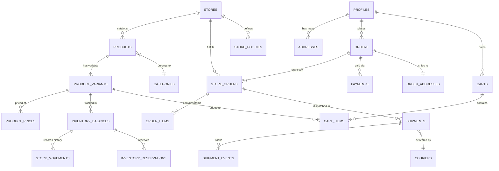

# Aura Bell — Entity Relationship Diagram (ERD)

নিচে Aura Bell প্ল্যাটফর্মের কোর ডোমেনসমূহের মধ্যকার রিলেশনাল নির্ভরতা তুলে ধরা হলো:

```mermaid
erDiagram
    PROFILES ||--o{ ADDRESSES : "has many"
    PROFILES ||--o{ ORDERS : "places"
    PROFILES ||--o{ CARTS : "owns"
    
    STORES ||--o{ PRODUCTS : "catalogs"
    STORES ||--o{ STORE_ORDERS : "fulfills"
    STORES ||--o{ STORE_POLICIES : "defines"
    
    PRODUCTS ||--|{ PRODUCT_VARIANTS : "has variants"
    PRODUCTS }|--|| CATEGORIES : "belongs to"
    PRODUCT_VARIANTS ||--o{ PRODUCT_PRICES : "priced at"
    PRODUCT_VARIANTS ||--o{ INVENTORY_BALANCES : "tracked in"
    PRODUCT_VARIANTS ||--o{ CART_ITEMS : "added to"
    
    CARTS ||--o{ CART_ITEMS : "contains"
    
    ORDERS ||--|{ STORE_ORDERS : "splits into"
    ORDERS ||--o{ PAYMENTS : "paid via"
    ORDERS ||--|| ORDER_ADDRESSES : "ships to"
    
    STORE_ORDERS ||--|{ ORDER_ITEMS : "contains items"
    STORE_ORDERS ||--o{ SHIPMENTS : "dispatched in"
    
    SHIPMENTS ||--o{ SHIPMENT_EVENTS : "tracks"
    SHIPMENTS }|--|| COURIERS : "delivered by"
    
    INVENTORY_BALANCES ||--o{ STOCK_MOVEMENTS : "records history"
    INVENTORY_BALANCES ||--o{ INVENTORY_RESERVATIONS : "reserves"
```
