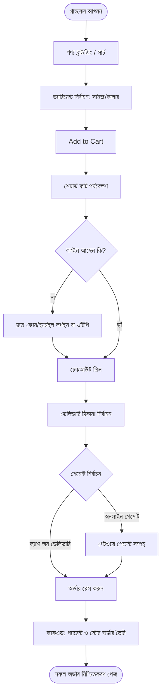

# Aura Bell — End-to-End User Flows (ব্যবহারকারী প্রবাহ)

```mermaid
flowchart TD
    Start([গ্রাহকের আগমন]) --> Browse[পণ্য ব্রাউজিং / সার্চ]
    Browse --> Select[ভ্যারিয়েন্ট নির্বাচন: সাইজ/কালার]
    Select --> AddCart[Add to Cart]
    AddCart --> ViewCart[শেয়ার্ড কার্ট পর্যবেক্ষণ]
    ViewCart --> AuthCheck{লগইন আছেন কি?}
    AuthCheck -- না --> Login[দ্রুত ফোন/ইমেইল লগইন বা ওটিপি]
    Login --> Checkout
    AuthCheck -- হ্যাঁ --> Checkout[চেকআউট স্ক্রিন]
    Checkout --> AddressSelect[ডেলিভারি ঠিকানা নির্বাচন]
    AddressSelect --> PaySelect{পেমেন্ট নির্বাচন}
    PaySelect -- ক্যাশ অন ডেলিভারি --> PlaceOrder[অর্ডার প্লেস করুন]
    PaySelect -- অনলাইন পেমেন্ট --> Gateway[গেটওয়ে পেমেন্ট সম্পন্ন]
    Gateway --> PlaceOrder
    PlaceOrder --> Split[ব্যাকএন্ড: প্যারেন্ট ও স্টোর অর্ডার তৈরি]
    Split --> Success([সফল অর্ডার নিশ্চিতকরণ পেজ])
```
